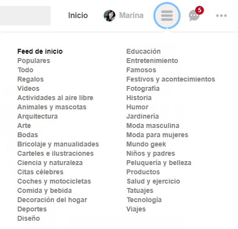
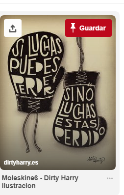
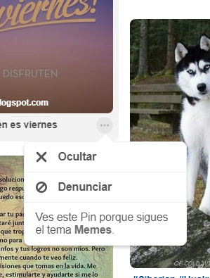
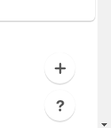
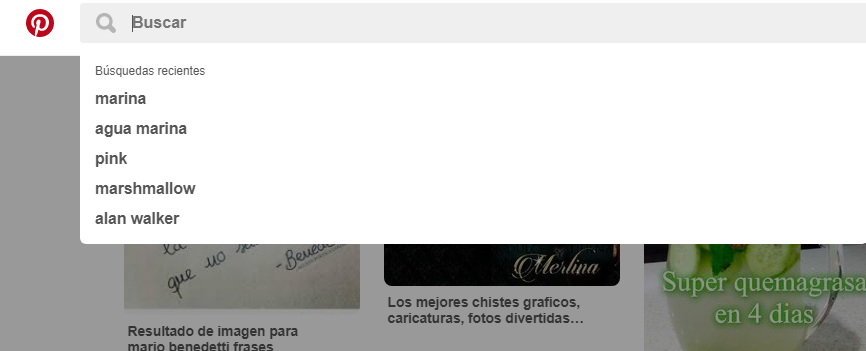
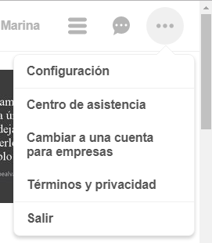

# PINTEREST  UX vs UI

## Objetivo
---
En este reto,conoceremos las diferencias del trabajo de un UX con UI, mediante una pagina muy conocida como Pinterest.

## UX
---

* Tener un menu ,donde mostrar las categorias de pines existentes.

* Tener atajos de guardar,compartir y la fuente de referencia.

* Si al usuario le parece inapropiada la imagen tener la opcion de ocultar o denunciar.

* Tener opcion de acceso directo y a un centro de asistencia .

* Contar con un buscador de pines.

* Al posicionarse en el buscador muestra sugerencias de busqueda y tu historial de busquedas.
 

* Tener opciones de configuracion y poder cambiar el tipo de cuenta a Empresa.

## UI
---
